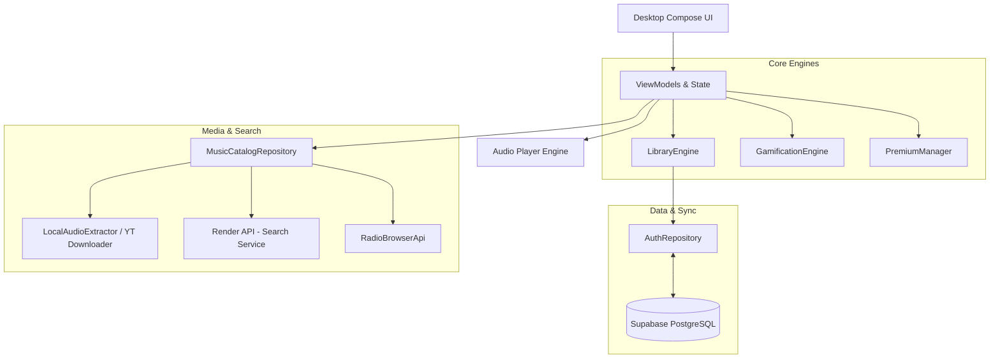
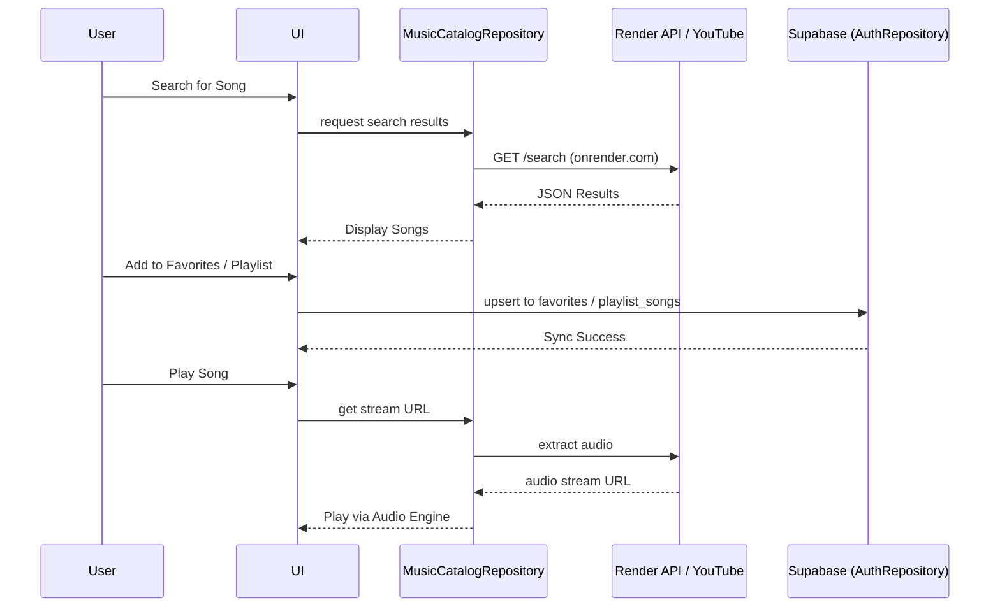

# Watermelon Music Desktop 🍉

Welcome to the **Watermelon Music Desktop** repository! This application is built using **Compose for Desktop** (Kotlin) and serves as the official desktop client for the Watermelon Music ecosystem.

## 🏗 Information Architecture

Watermelon Desktop follows a modern, reactive architecture connecting the Compose UI to a robust data layer powered by Supabase and Render.



## 🔄 Core Workflow

The typical user journey for discovering and playing a song involves seamless communication between the UI, the custom search API, and our Supabase backend.



## 📂 File Arrangement & Repository Structure

```text
Watermelon-exe/
├── src/main/kotlin/com/watermelon/music/
│   ├── Main.kt                     # Application Entry Point & Window Setup
│   ├── data/
│   │   ├── AuthRepository.kt       # Supabase Authentication & Syncing
│   │   ├── LibraryEngine.kt        # Local Library State Management
│   │   ├── GamificationEngine.kt   # XP, Leveling, and Achievements
│   │   ├── PremiumManager.kt       # Premium Features Control
│   │   ├── SupabaseModule.kt       # PostgREST Client Initialization
│   │   ├── remote/                 # API Interfaces (Retrofit, Render, RadioBrowser)
│   │   └── youtube/                # Audio Extraction & Downloading
│   ├── repository/
│   │   └── MusicCatalogRepository.kt # Centralized Music Fetching
│   ├── domain/                     # Business Logic Models
│   └── ui/                         # Compose UI Components & Screens
├── build.gradle.kts                # Gradle Configuration & Dependencies
└── README.md                       # This File
```

## 🚀 Getting Started

1. **Prerequisites:** Ensure you have JDK 17+ installed.
2. **Build:** Run `./gradlew packageDistributionForCurrentOS` to generate the `.exe` (or `.dmg` / `.deb` depending on OS).
3. **Run:** Execute the generated binary from the `build/compose/binaries` directory.

## 🛠 Features
- **Direct Database Syncing:** Favorites and playlists instantly sync with your mobile app via Supabase.
- **Background Audio Fetching:** Real-time stream URL extraction.
- **Global Radio Station Integration:** Stream thousands of radio stations natively.
- **Gamification:** Earn XP and level up as you listen.

---
*Built with ❤️ for the Watermelon Music Ecosystem.*
