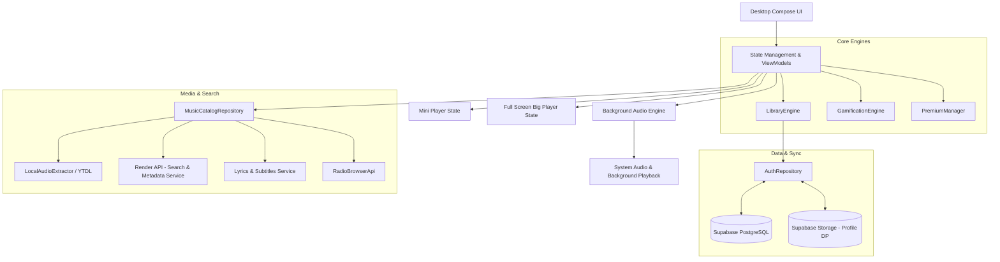
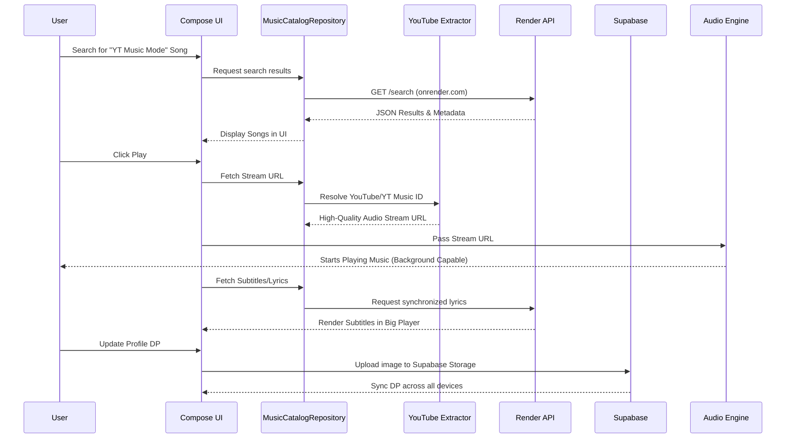

# Watermelon Music Desktop 🍉

Welcome to the **Watermelon Music Desktop (Watermelon-exe)** repository! 
This application is the official desktop client for the Watermelon Music ecosystem, built natively with **Compose for Desktop** (Kotlin). It seamlessly mirrors the Watermelon mobile application, offering a unified, high-performance, and feature-rich music streaming experience directly on your Windows PC.

---

## 🏗 Comprehensive Information Architecture

The Watermelon Desktop app utilizes a robust, reactive architecture that tightly couples an immersive UI with a highly efficient backend and media engine.



---

## 🔄 Detailed Core Workflow

The user journey—from discovering a song to playing it in the background—involves multiple highly optimized subsystems.



---

## 🚀 Deep Dive: Core Features & Functionality

### 1. YouTube Extractor (YTDL) & Audio Playback
Watermelon Desktop does not rely on simple web views. It natively extracts audio streams:
- **How it works:** When you play a song, `LocalAudioExtractor` and `YouTubeDownloader` kick into gear. They resolve the YouTube / YT Music ID and extract the raw, high-quality audio stream URL.
- **Audio Engine:** This stream is fed directly into the native Audio Engine.
- **Background Playback:** Because it is a native desktop application, the audio engine runs on a dedicated thread. This allows you to minimize the application, and the music will continue to play flawlessly in the background without interruptions. Windows manages the audio output natively.

### 2. YT Music Mode
- The application interfaces with our custom **Render API service** to provide a seamless "YT Music Mode". This mode accurately fetches metadata, albums, artist information, and search results mirroring the vast YT Music catalog, delivering exactly what the user is searching for in milliseconds.

### 3. Subtitles & Lyrics
- **Fetching:** As soon as a song begins, the application queries our subtitle/lyrics endpoints.
- **Rendering:** The UI parses the timestamped LRC data (or raw text) and dynamically highlights the current lyric inside the **Big Player**, keeping you perfectly in sync with the song.

### 4. Big Player vs. Mini Player
- **Big Player:** When expanded, the Big Player dominates the screen, providing a rich, immersive experience. It displays high-resolution album art, synchronized subtitles, upcoming queue items, and advanced playback controls.
- **Mini Player:** For multitasking, the UI transitions smoothly into the Mini Player. This compact, always-accessible widget sits unobtrusively on your screen, offering essential controls (Play, Pause, Skip) and current track info while you focus on other desktop tasks.

### 5. Profile & Display Picture (DP) System
- Powered by `AuthRepository`, your Watermelon Profile is perfectly synced.
- **DP Management:** When you upload or change your Profile Picture (DP), the application securely authenticates and uploads the image to **Supabase Storage**. It then updates your user record, instantly reflecting the new DP across both your desktop and mobile applications.

### 6. Gamification Engine (XP & Leveling)
- The desktop app features a comprehensive `GamificationEngine`.
- **How it works:** Every time you listen to a song, explore a new artist, or curate a playlist, the engine calculates and awards you XP.
- As you hit XP thresholds, you level up. This system tracks your engagement and rewards you, turning your music listening habits into an interactive, rewarding experience.

### 7. Direct Database Syncing
- All your Favorites, Playlists, and Radio Stations are directly synced with **Supabase PostgreSQL**. 
- Adding a song to a playlist on your PC will instantly appear on your mobile app, and vice versa. There is zero polling delay—data is fetched and updated reactively.

---

## 📂 File Arrangement & Repository Structure

Understanding the codebase is simple. The architecture is cleanly divided into data, domain, and UI layers:

```text
Watermelon-exe/
├── src/main/kotlin/com/watermelon/music/
│   ├── Main.kt                     # Application Entry Point & Window Initialization
│   ├── data/
│   │   ├── AuthRepository.kt       # Supabase Auth, Profile DP, Playlists & Syncing
│   │   ├── LibraryEngine.kt        # Local Library State & Offline Management
│   │   ├── GamificationEngine.kt   # XP, Leveling, and User Rewards System
│   │   ├── PremiumManager.kt       # Premium Features Control & Validation
│   │   ├── SupabaseModule.kt       # PostgREST Client Initialization
│   │   ├── remote/                 # API Interfaces (Render Search, RadioBrowser)
│   │   └── youtube/                # YTDL: LocalAudioExtractor & YouTubeDownloader
│   ├── repository/
│   │   └── MusicCatalogRepository.kt # Centralized Music Fetching & Subtitles
│   ├── domain/                     # Business Logic Models & Dataclasses
│   └── ui/                         # Compose UI: Big Player, Mini Player, Screens
├── build.gradle.kts                # Gradle Configuration & Desktop Build Scripts
└── README.md                       # This Master Documentation File
```

---

## 🛠 Compilation & Deployment

To compile the application for Windows:
1. **Prerequisites:** Ensure you have JDK 17+ installed on your machine.
2. **Compile:** Run the gradle command:
   ```bash
   ./gradlew packageDistributionForCurrentOS
   ```
3. **Output:** The final `.exe` installer and standalone binary will be generated inside `build/compose/binaries/main/exe/`.

---
*Built with ❤️ for the Watermelon Music Ecosystem.*
