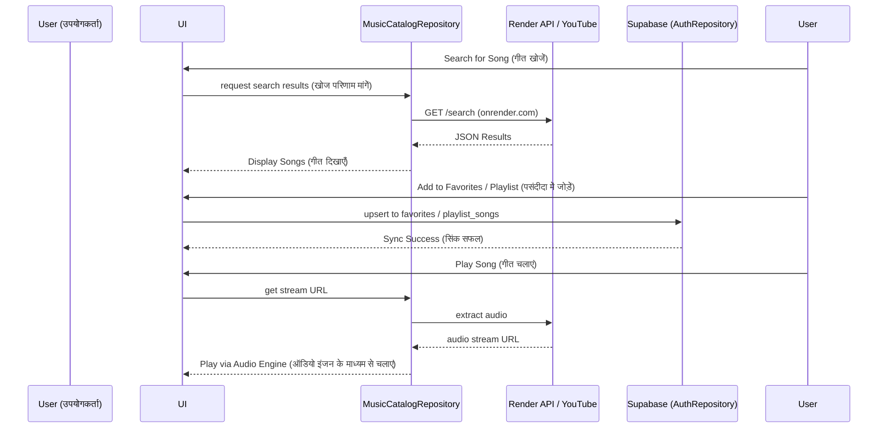

# Watermelon Music Desktop 🍉 (तरबूज संगीत डेस्कटॉप)

**Watermelon Music Desktop** रिपॉजिटरी में आपका स्वागत है! यह एप्लिकेशन **Compose for Desktop** (Kotlin) का उपयोग करके बनाया गया है और वाटरमेलन म्यूजिक इकोसिस्टम के लिए आधिकारिक डेस्कटॉप क्लाइंट के रूप में कार्य करता है।

## 🏗 सूचना वास्तुकला (Information Architecture)

वाटरमेलन डेस्कटॉप एक आधुनिक, प्रतिक्रियाशील वास्तुकला (reactive architecture) का पालन करता है जो Compose UI को Supabase और Render द्वारा संचालित मजबूत डेटा परत से जोड़ता है।

```mermaid
graph TD
    UI[Desktop Compose UI] --> VM[ViewModels & State]
    
    subgraph Core Engines (मुख्य इंजन)
    VM --> Lib[LibraryEngine]
    VM --> Game[GamificationEngine]
    VM --> Premium[PremiumManager]
    end
    
    subgraph Data & Sync (डेटा और सिंक)
    Lib --> Auth[AuthRepository]
    Auth <--> Supabase[(Supabase PostgreSQL)]
    end
    
    subgraph Media & Search (मीडिया और खोज)
    VM --> Catalog[MusicCatalogRepository]
    Catalog --> YTExtractor[LocalAudioExtractor / YT Downloader]
    Catalog --> RenderAPI[Render API - Search Service]
    Catalog --> RadioAPI[RadioBrowserApi]
    end
    
    VM --> Player[Audio Player Engine]
```

## 🔄 मुख्य कार्यप्रवाह (Core Workflow)

किसी गीत को खोजने और चलाने के लिए उपयोगकर्ता की यात्रा में UI, कस्टम सर्च API और हमारे Supabase बैकएंड के बीच निर्बाध संचार शामिल है।



## 📂 फ़ाइल व्यवस्था और रिपॉजिटरी संरचना (File Arrangement)

```text
Watermelon-exe/
├── src/main/kotlin/com/watermelon/music/
│   ├── Main.kt                     # एप्लिकेशन एंट्री पॉइंट और विंडो सेटअप
│   ├── data/
│   │   ├── AuthRepository.kt       # Supabase प्रमाणीकरण और सिंकिंग
│   │   ├── LibraryEngine.kt        # स्थानीय लाइब्रेरी स्टेट प्रबंधन
│   │   ├── GamificationEngine.kt   # XP, लेवलिंग और उपलब्धियां
│   │   ├── PremiumManager.kt       # प्रीमियम सुविधाएँ नियंत्रण
│   │   ├── SupabaseModule.kt       # PostgREST क्लाइंट इनिशियलाइज़ेशन
│   │   ├── remote/                 # API इंटरफेस (Retrofit, Render, RadioBrowser)
│   │   └── youtube/                # ऑडियो निष्कर्षण और डाउनलोडिंग
│   ├── repository/
│   │   └── MusicCatalogRepository.kt # केंद्रीकृत संगीत फ़ेचिंग
│   ├── domain/                     # बिजनेस लॉजिक मॉडल
│   └── ui/                         # Compose UI कंपोनेंट्स और स्क्रीन
├── build.gradle.kts                # ग्रैडल कॉन्फ़िगरेशन और निर्भरताएँ
└── README.md                       # यह फ़ाइल (This File)
```

## 🚀 शुरुआत कैसे करें (Getting Started)

1. **पूर्वापेक्षाएँ (Prerequisites):** सुनिश्चित करें कि आपके पास JDK 17+ स्थापित है।
2. **बिल्ड (Build):** `.exe` (या OS के आधार पर `.dmg` / `.deb`) उत्पन्न करने के लिए `./gradlew packageDistributionForCurrentOS` चलाएँ।
3. **चलाएं (Run):** `build/compose/binaries` निर्देशिका से उत्पन्न बाइनरी को निष्पादित करें।

## 🛠 विशेषताएँ (Features)
- **डायरेक्ट डेटाबेस सिंकिंग:** पसंदीदा और प्लेलिस्ट तुरंत Supabase के माध्यम से आपके मोबाइल ऐप के साथ सिंक हो जाते हैं।
- **बैकग्राउंड ऑडियो फ़ेचिंग:** रीयल-टाइम स्ट्रीम URL निष्कर्षण।
- **ग्लोबल रेडियो स्टेशन इंटीग्रेशन:** मूल रूप से हजारों रेडियो स्टेशनों को स्ट्रीम करें।
- **गेमिफिकेशन:** संगीत सुनते हुए XP अर्जित करें और लेवल अप करें।

---
*वाटरमेलन म्यूजिक इकोसिस्टम के लिए ❤️ के साथ निर्मित।*
